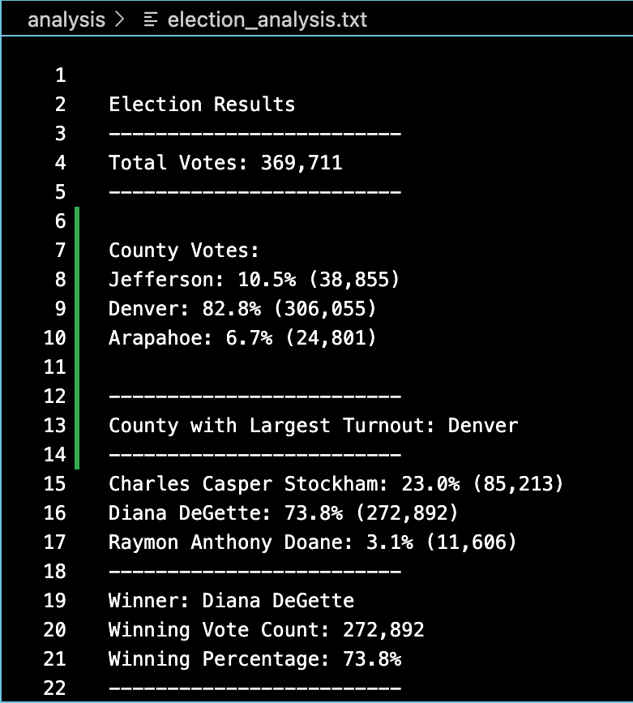

# Election_Analysis

## Project Overview

A Colorado Board of Elections employee asked us to complete an election audit for a recent local congressional election.
In this audit, they were looking for the following results:

1. Calculate the total number of votes cast.
2. Provide a breakdown of the number of votes and the percentage of total votes for each county in the precinct.
3. Which county had the largest number of votes (the largest turnout).
4. Provide a breakdown of the number of votes and the percentage of the total votes each candidate received
5. Which candidate won the election, what was their vote count, and what was their percentage of the total votes.

## Resources

Data Source: [election data](resources/election_results.csv)

Software used: Python 3.8.9, Visual Studio Code

## Results

From our analysis we found the following results:
1. Using a for loop (seen in line 43 and 47 of [code script](PyPoll_Challenge.py)), we  found that there were 369,700 votes cast in the election.

2. There were three counties in this precinct: Jefferson, Denver and Araphoe. Using for loops nested with if statements (found in line 96-107 of [code script](PyPoll_Challenge,py)), we found the vote count and the percentage of the total vote for each county. 
Jefferson: 10.5% (38,855)
Denver: 82.8% (306,055)
Arapahoe: 6.7% (24,801)

3. From this information, we were able to determine that Denver was the county that had the largest voter turnout in this election.

4. Then we looked to the candidate data in order to determine the vote count and percentage of the total vote for each candidate who receieved votes. Similar to our county analysis, we ran a for for loop with a nested if statement (found in lines 129-156 of [code script](PyPoll_Challenge.py)) in order to determine this information. Our results were as follows:
Charles Casper Stockham received 23% of the vote with 85,213 votes
Diana DeGette received 73.8% of the vote with 272,892 votes
Raymon Anthony Doane received 3.1% of the vote with 11,606 votes

5. Then from these results we were able to determine the winner of the election. 
The winner of the election was Diana DeGette, with 272,892 votes which was 73.8% of the total vote count.

Using the txt_file.write function, we were able to save these results to our [text file](analysis/election_analysis.txt)

Or you can see below in this image:

## Summary 

In summary, this analysis shows that our script created for this election analysis was very successful. We were able to determine all the results that the election committee was looking for.
We believe that this script could be used for other elections as well. However, there would be a few modifications that would potentially have to be made for other elections.  
For example, if there was an election where there were multiple people running for different parts of the government or legislature. As an example, during the federal election, most voters will get a ballot which contains multiple candidates for multiple different parts of government (president, senator, congressman etc.). In this case, we would have to add more for loops in order to circle through the larger amount of candidates and filter them by the position they are being elected for. This code would end up being much more complex.
Another reason for modifying would be if there were any errors in our vote collection. If the votes were cast and collected in a different way, say by written by hand and not by a computed system, you would most likely have to deal with errors in the data set. If this was the case you would want to modify this original code to incorporate python formulas to remove data (depending on if appropriate) from the set before running. 
